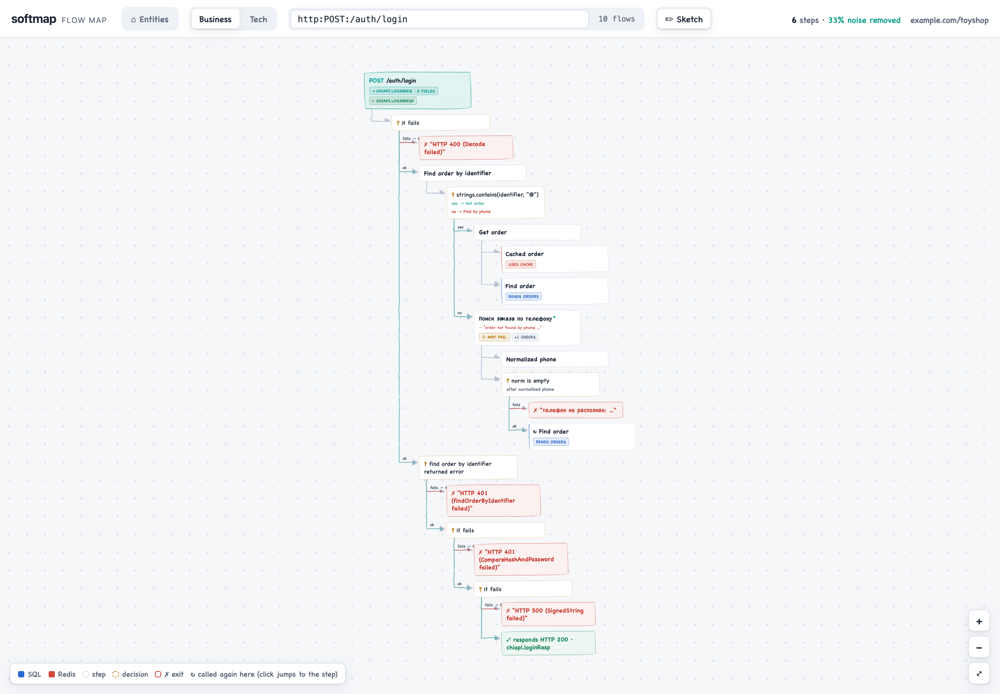
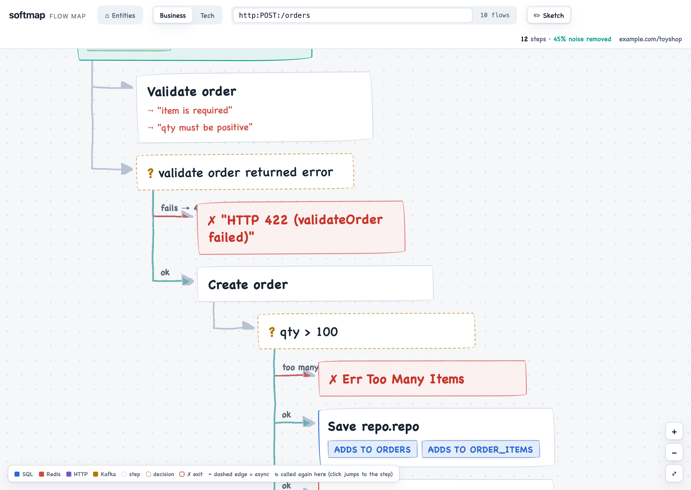
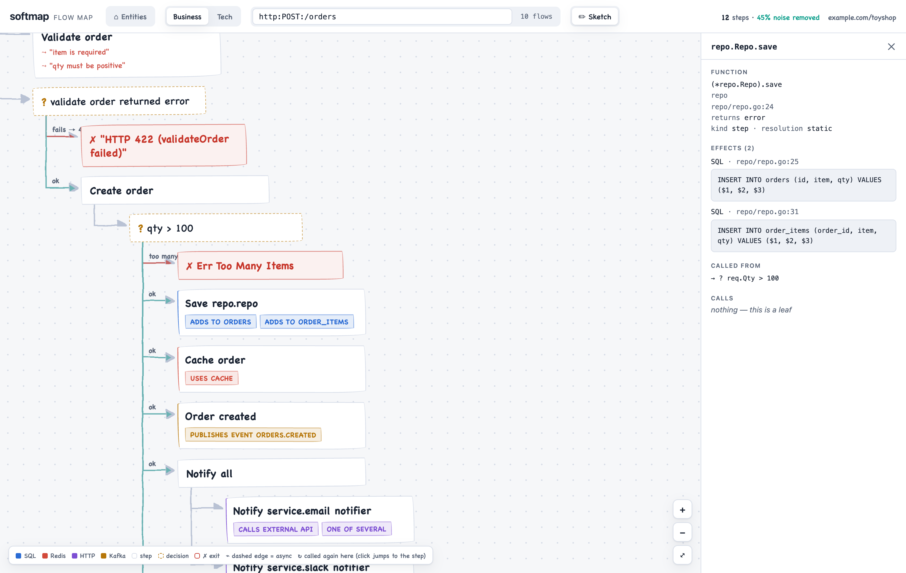
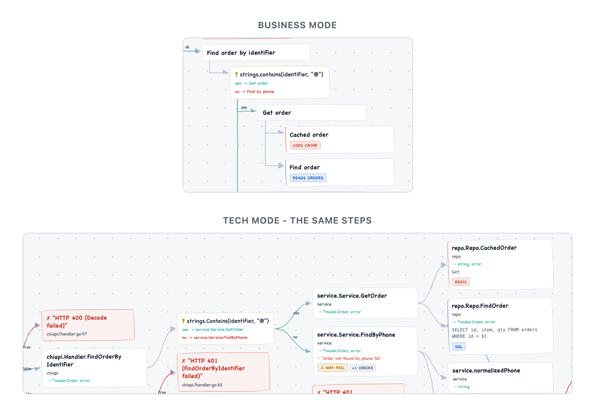
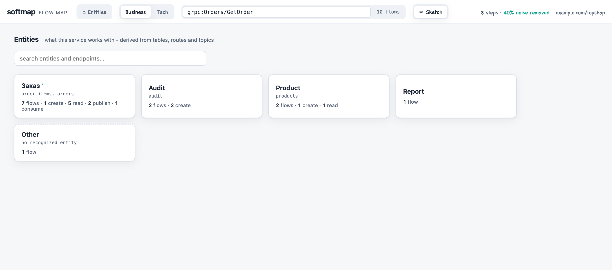

# softmap

softmap statically analyzes a Go codebase and turns each entrypoint — an HTTP
route, a gRPC method, a Kafka consumer — into a readable flow map: the chain
of meaningful steps from the entrypoint through checks and decisions to
database writes, published events, and every way the flow can end. As more
code is written by AI, the bottleneck shifts from writing it to understanding
what the system actually does; softmap makes that understanding a shared,
regenerable artifact instead of one developer's mental model.



The core mechanism is aggressive, honest noise reduction: Gitea's
create-pull-request handler is a raw call graph of 1639 functions; softmap
renders it as a 46-node flow with every SQL query and HTTP call tagged — and
every dropped node accounted for in `--debug-tree`.

## Quickstart

Requires Go 1.21+ — `go install` automatically fetches the newer toolchain
softmap builds with.

```sh
go install github.com/softmapio/softmap/cmd/softmap@latest
```

Scan your own service:

```sh
softmap scan . --all --html -o softmap-out
open softmap-out/index.html        # xdg-open on Linux
```

Or try it on a codebase you don't know — Gitea. Gitea registers routes
through its own wrapper around chi, which discovery does not see through, so
this is also a demo of the `func:` escape hatch — point softmap at any
function and get its map:

```sh
git clone --depth 1 --branch v1.24.3 https://github.com/go-gitea/gitea
softmap scan gitea \
  --entrypoint "func:code.gitea.io/gitea/routers/api/v1/repo.CreatePullRequest" \
  --html -o gitea-map
open gitea-map/index.html
```

On this machine (M-series laptop) that scan loads 362 packages, builds a VTA
call graph, and writes the map in well under a minute. On a repo that uses
net/http, chi, gin, echo, fiber, or gorilla/mux directly, plain `softmap scan <path>`
lists what it found:

```
ID                                 FUNC                               POS
grpc:Orders/GetOrder               (grpcserver.Server).GetOrder       grpcserver/server.go:28
http:GET:/orders/{id}              (*handlers.Handler).GetOrder       handlers/handler.go:69
http:POST:/auth/login              (*chiapi.Handler).Login            chiapi/handler.go:53
kafka:orders.created:consumer.Run  consumer.Run                       consumer/consumer.go:16
...
```

The flags that matter:

| Flag | Meaning |
|---|---|
| `--entrypoint <id>` | a discovered id, or `func:<pkg>.<Name>` for anything discovery missed |
| `--all` | one flow per discovered entrypoint, plus `index.json` with the entity shelf |
| `--html` | self-contained interactive viewer (with `--all -o`: all flows in one page) |
| `--debug-tree` | full flow tree on stderr with every filter decision annotated |
| `--no-filter` | raw module-code graph, no noise pipeline |

## What you get

**Flow maps with decisions and outcomes.** Semantic guards — permission
gates, business validations — render as decision nodes with the
developer-written error text as red exits; success ends in an explicit
terminal ("✓ responds HTTP 200"). Mechanical `if err != nil` propagation
stays off the map as a "may fail" badge, so decisions that remain are the
ones that mean something.



**Effects on nodes.** Steps are tagged with what they touch: SQL with the
query text, Kafka topics (publish and consume), Redis, outgoing HTTP and gRPC
with the target service, password hashing and JWT issuing, object storage.



**Business and Tech modes.** The same map, two audiences. Business mode:
humanized step names, effect phrases ("writes database", "publishes event
orders.created"), outcome-first decisions — readable by an analyst without an
IDE. Tech mode: full identifiers, query texts, return types, positions.



**Entity shelf.** With `--all`, softmap derives the nouns your flows touch —
from SQL table names, URL segments, and Kafka topic prefixes — and the viewer
opens on an entity home screen ("order — 7 flows: 1 create · 5 read ·
2 publish"), click-through grouped by access kind. Flows with no signal land
on an honest "Other" shelf; an entity is never guessed.



**Tunable labels.** A `.softmap.yaml` next to the analyzed repo's `go.mod`
renames what the code names badly — overridden text carries a • marker so
manual labels stay distinguishable from derived ones:

```yaml
overrides:
  "(*service.Service).FindByPhone": "Find order by phone"   # node label
  "repo/repo.go:31": "load order from DB"                    # effect label
entities:
  order: "Customer order"    # entity shelf display name
merge:
  order: [shipments]         # fold satellite tables under one entity
```

## How it works, and why you can trust it

softmap builds on the Go toolchain's own analysis stack: `go/packages` +
`go/ssa`, with a VTA call graph (CHA fallback). No code is executed.

- **Runs entirely on your machine.** The scan makes no network calls and
  sends nothing anywhere; the only downloads are your target's own Go module
  dependencies, fetched by the standard toolchain exactly as `go build`
  would. The binary depends on `golang.org/x/tools` and `yaml` — nothing
  else.
- **No LLM anywhere.** Every label, decision, and effect is derived from the
  code by deterministic rules. Given the same code and the same call-graph
  algorithm, output is byte-identical (golden-tested), so maps are diffable
  between versions with plain `diff` — pin `--algo vta` in CI if you rely on
  that, since the only run-to-run variable is the VTA time budget falling
  back to CHA on a slow machine.
- **Every claim is traceable.** Each node and effect carries its `file:line`,
  shown in the detail panel.
- **Uncertainty is marked, never papered over.** Dynamic calls the analysis
  cannot resolve, Kafka topics it cannot trace to a constant, and filter
  decisions are all reported as such — `--debug-tree` shows the full tree
  with every kept/dropped decision annotated.

## Honest limitations

- **Go only**, for now. Deep static analysis is per-language; a manifest
  format for non-Go services in a polyglot map is a possible later step.
- **Discovery is best-effort.** It covers net/http (incl. Go 1.22 route
  patterns), chi, gin, echo, gorilla/mux, fiber (v2 and v3),
  protoc-generated gRPC registration, and common Kafka consumers. Codebases
  that wrap their router (like Gitea) need `--entrypoint func:<pkg>.<Name>`
  per flow — and `--all` finds nothing there, since it maps only discovered
  entrypoints. See [My router isn't detected](#my-router-isnt-detected).
- **Your repo must compile.** Analysis loads and type-checks the target;
  broken builds or unreachable private modules fail the scan. The softmap
  binary itself must be built with a Go toolchain at least as new as the
  target's `go` directive — `go install` picks one automatically, and a scan
  that fails with "requires newer Go version" tells you the exact reinstall
  command.
- **Dynamic dispatch is approximated.** VTA resolves most interface calls;
  reflection and hand-built function tables show up as unresolved rather
  than guessed. On very large repos VTA can hit its time budget
  (`--vta-timeout`, default 2m) and fall back to the coarser CHA — the
  stats line tells you when.
- **Filter rules ship embedded.** `softmap rules --defaults` prints them;
  `--no-filter` disables them. A flag to layer your own rules file on top is
  planned but not implemented yet.

## My router isn't detected

`phase=discover ... entrypoints=0` means route registration wasn't
recognized — most often because the router is registered through a wrapper
of your own (`s.router.GET(...)` inside a helper) rather than called
directly. Nothing is wrong with your repo, and every map still works: point
softmap at a handler and it builds that flow.

```sh
softmap scan . --entrypoint "func:(*api.Handler).CreateOrder" --html -o out
```

The name is the handler's qualified Go name, and any unambiguous suffix of
it is enough (`func:api.Handler).CreateOrder`, or `func:consumer.Run` for a
plain function). A zero-discovery run prints request-shaped names taken from
your own code, so you can copy the form from there. Route paths in generated
ids use one syntax whatever your router writes — `:id`, `{id}` and `*` all
appear as `{id}` / `{*}` — and `--entrypoint` accepts either spelling.

If your router is a common one, please [open an
issue](https://github.com/softmapio/softmap/issues/new/choose) with the
registration snippet (the `app.Get("/x", h.X)` line and how the router value
is built). Adding a framework is a matcher plus a fixture; fiber support
started as exactly that report.

## FAQ

**Can't I just ask an AI assistant about my code?** You can, and the answer
helps you — once, and only if it's right. A chat reply is per-developer,
non-reproducible, and can hallucinate. softmap is a deterministic team
artifact: the same map for everyone, including analysts who don't have an
IDE, every step traceable to `file:line`, regenerable in CI on every merge,
and diffable between versions (a diff CLI is on the roadmap). Static
analysis is the fact layer; an optional LLM labeling pass may come later —
on top of the facts, not instead of them.

**Is it safe to run on private code?** Yes. The scan runs locally, executes
nothing, and transmits nothing. There is no telemetry. The output is files
in the directory you chose.

**Why only Go?** Because this depth — SSA-level guard classification, call
graphs, effect detection per driver library — has to be built per language.
Go is where we can be precise today; precision is the product.

**How is this different from go-callvis or doc generators?** go-callvis
draws the call graph itself — on a real service that's thousands of edges.
softmap's core is what it removes and what it adds: the noise pipeline takes
1639 raw nodes to 46, and the semantic layer adds what a call graph doesn't
have — decisions with their error texts, SQL/Kafka effects, outcomes, and a
non-developer mode. Doc generators (godoc, Swagger) describe the declared
surface; softmap describes behavior.

## Feedback

softmap is early and we want brutal feedback — especially "I scanned my repo
and the map was wrong/confusing here". Screenshots of confusing fragments
are the most useful thing you can send.

- **Bugs** (crash, missed entrypoint, wrong effect) and **map feedback**
  (technically correct but unreadable or misleading):
  [open an issue](https://github.com/softmapio/softmap/issues/new/choose) —
  the templates ask for the stats lines, a `--debug-tree` excerpt, and
  "what did you expect to see, what did you get".
- Email: [hello@softmap.io](mailto:hello@softmap.io)

## Development

```sh
make build     # bin/softmap
make test      # hermetic: fixture deps are local stubs, no network
scripts/bench-gitea.sh   # real-world benchmark (clones Gitea on first run)
```

[docs/ARCHITECTURE.md](docs/ARCHITECTURE.md) covers the pipeline (loader →
entrypoints → call graph → extraction → filter → output), the honesty and
degradation model, and how to extend softmap with new frameworks, effect
libraries, or filter heuristics.

## License & roadmap

Apache-2.0. Next up, without dates: map diffs between releases, and hosted
maps for teams.
